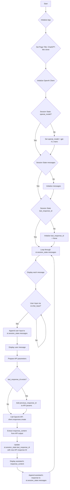

```mermaid
graph TD
    A[Start] --> B{Initialize App};
    B --> C{Set Page Title: ChatGPT-like clone};
    C --> D{Initialize OpenAI Client};
    D --> E{Session State: openai_model?};
    E -- No --> F[Set openai_model = gpt-4.1-nano];
    E -- Yes --> G;
    F --> G;
    G{Session State messages};
    G -- No --> H[Initialize messages];
    G -- Yes --> I;
    H --> I;
    I{Session State last_response_id};
    I -- No --> J[Initialize last_response_id = None];
    I -- Yes --> K;
    J --> K;

    K[Loop through st.session_state.messages] --> L{Display each message};
    L --> M{User Input via st.chat_input?};
    M -- No --> M;
    M -- Yes --> N[Append user input to st.session_state.messages];
    N --> O[Display user message];
    O --> P[Prepare API parameters];
    P --> Q{last_response_id exists?};
    Q -- Yes --> R[Add previous_response_id to API params];
    Q -- No --> S;
    R --> S;
    S[Call OpenAI API: client.responses.create];
    S --> T[Extract response_content from API output];
    T --> U[Update st.session_state.last_response_id with new API response ID];
    U --> V[Display assistant's response_content];
    V --> W[Append assistant's response to st.session_state.messages];
    W --> K;
``` 